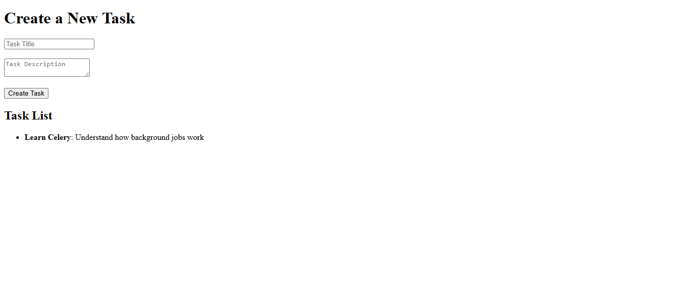
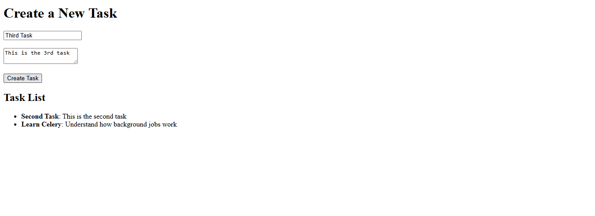

# TaskManager App


<br>


## Overview
This is a simple task manager application consists of Django for handling HTTP/API requests, Celery for managing background jobs, Redis as the message broker, simple HTML form (Django Template) to create a Task, and Docker for containerizing Django (web app), Celery (worker) and Redis (broker).

The application allows users to create tasks that will send background notifications (emails or fake emails) after a specified delay. 

User submits a new Task via API or Form. Django saves Task in database. Django calls Celery: "Hey, send a notification for this new Task!" Celery Worker picks up the job in background and logs notification.

## Project Architecture Diagram:
```less
[django-app-container] --talks-to--> [redis-container]
        |                                ^
        v                                |
[celery-worker-container] --pulls tasks-- 
```

## Project Setup
```bash
docker-compose build
docker-compose up -d

docker-compose logs -f
docker-compose logs -f worker
docker-compose logs -f web

# Test the API (GET and POST) 
http://127.0.0.1:8000/api/tasks/         # API
http://127.0.0.1:8000/api/task-form/     # Html template

# Open your browser:
# Django App: http://localhost:8000/api/task-form/
# Try creating a Task.
# Then watch Celery Worker logs (docker-compose logs -f worker) to see background processing happen!

# To stop the containers
docker-compose down
# This will: Stop all services + Remove the containers (but not the images or volumes unless you specify)

# if you want to also remove everything including networks and volumes (careful!):
docker-compose down -v

```


